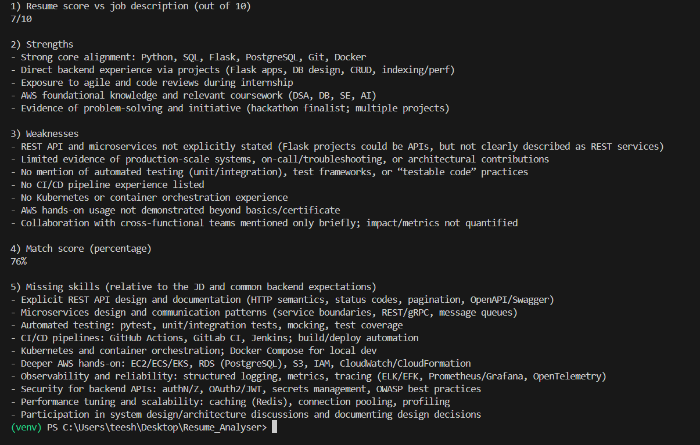

# AI Resume Analyser

A Python application that analyses resumes against job description using AI.

## Features

* Extracts text from PDF resumes generated using AI
* Compares resumes with a job description generated using AI
* Identifies missing skills
* Provides Strengths and weaknesses
* Generates AI-powered feedback

## Technologies

* Python
* OpenAI API
* pdfplumber
* python-dotenv

## Setup

1. Install dependencies:

```bash
pip install -r requirements.txt
```

2. Create a `.env` file:

```env
OPENAI_API_KEY=your_api_key
```

3. Run the application:

```bash
py app.py
```

## Example Output


## Future Improvements in mind

* Streamlit UI
* Interview Question Generator
* Resume Upload Feature
